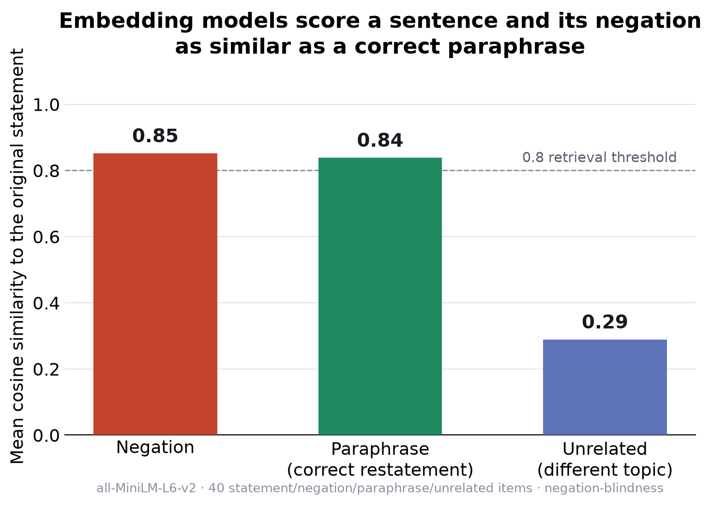
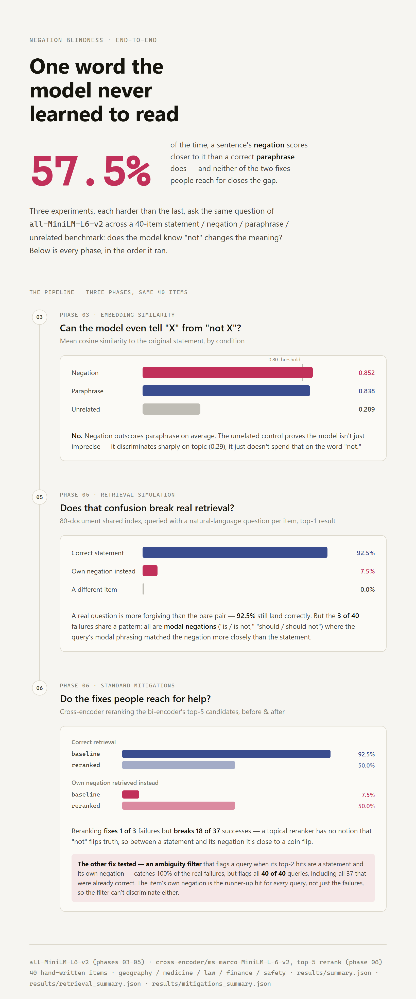
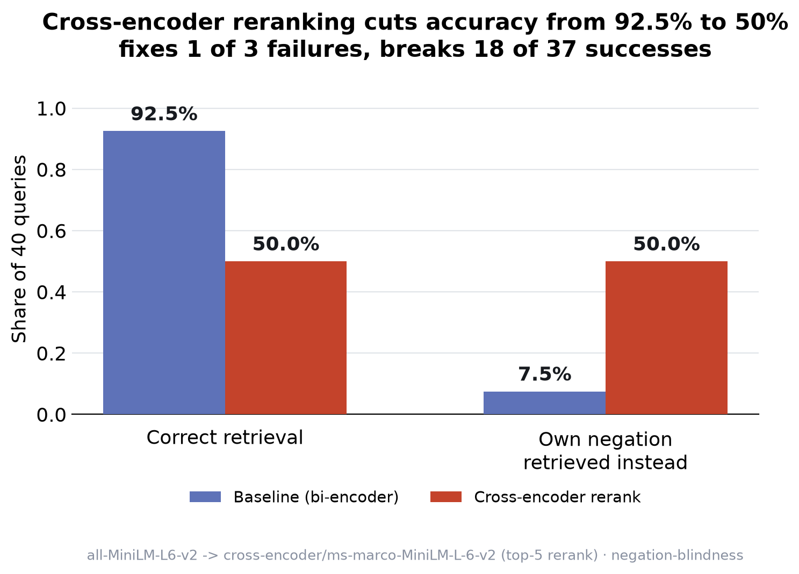

# Negation Blindness

Embedding models score a sentence and its own negation as almost identical to a
correct restatement of it. Vector search and RAG retrieval inherit that blindness —
they can find text *about* a topic, but not reliably tell whether that text agrees
with the query or contradicts it.



Every number below is produced by a script in this repo. Run `pip install -r
requirements.txt` and re-run any of them yourself — see [Reproducing](#reproducing).

**The whole pipeline, end to end** — embedding similarity → real retrieval → the
two mitigations that don't fix it:



## The finding

Across 40 hand-written statement/negation/paraphrase/unrelated groups spanning
geography, medicine, law, finance, and safety, embedded with
`all-MiniLM-L6-v2`:

| condition | mean similarity | median | min | max |
|---|---|---|---|---|
| negation | **0.8516** | 0.8628 | 0.6289 | 0.9718 |
| paraphrase | 0.8381 | 0.8632 | 0.5832 | 0.9566 |
| unrelated | 0.2888 | 0.2681 | 0.0047 | 0.6033 |

*(`run_metrics.py` → `results/summary.json`, `results/similarities.csv`)*

The mean similarity between a statement and its **negation** is higher than its
similarity to a correct **paraphrase**. On 57.5% of the 40 items, the negation
scores as a *closer* match than the paraphrase does. 75% of negations clear a 0.8
similarity threshold — a cutoff commonly used in practice to decide "relevant
enough to retrieve."

The negative control is why this is trustworthy rather than a fluke: unrelated
sentences score 0.2888 mean and **0%** clear that same threshold. The model has
plenty of discriminative power. It simply doesn't spend any of it on the word "not."

**It's worst where it matters most.** Broken down by domain, legal (0.8916) and
safety (0.8861) have the highest mean negation similarity of the five — and in
legal and medical, the negation outscores the paraphrase *on average*, not just on
individual items.

| domain | negation | paraphrase | unrelated |
|---|---|---|---|
| legal | 0.8916 | 0.8710 | 0.2732 |
| safety | 0.8861 | 0.8586 | 0.2993 |
| medical | 0.8738 | 0.8089 | 0.2557 |
| geography | 0.8164 | 0.8404 | 0.2963 |
| financial | 0.7902 | 0.8115 | 0.3193 |

## Does a bigger model fix it?

No — and the way it fails changes. Five models, same 40 items:

| model | negation | paraphrase | unrelated | neg > para | neg ≥ 0.8 |
|---|---|---|---|---|---|
| all-MiniLM-L6-v2 | 0.8516 | 0.8381 | 0.2888 | 57.5% | 75.0% |
| all-mpnet-base-v2 | 0.7962 | 0.8719 | 0.3208 | 25.0% | 52.5% |
| bge-base-en-v1.5 | 0.8498 | 0.9030 | 0.6096 | 17.5% | 87.5% |
| e5-base-v2 | 0.9279 | 0.9460 | 0.7955 | 25.0% | 100.0% |
| gte-base | 0.9481 | 0.9565 | 0.8149 | 45.0% | 100.0% |

*(`run_multi_model.py` → `results/model_comparison.json`)*

`mpnet` is the one model here that clearly separates negation from paraphrase. But
the newest, strongest retrieval models (`e5-base`, `gte-base`) compress *everything*
toward high similarity — including the unrelated control, now 0.7955–0.8149 mean
and 100% above threshold. They aren't more negation-aware; they're simply less
discriminative overall. Retrieval tightness (a low unrelated score) and
negation-sensitivity turn out to be separate axes, and no model tested is good on
both.

## Does this actually break retrieval?

The numbers above are pairwise similarity, not retrieval. To test it for real,
`run_retrieval.py` builds one shared 80-document index — every statement and every
negation from the dataset — and queries it with a natural-language question per
item (e.g. *"Is MRI safe for patients with a pacemaker?"*), never the statement
text itself.

```
full 80-document index, top-1 result:
  correct statement retrieved:      92.5%
  own negation retrieved instead:    7.5%
  a different item retrieved:        0.0%
```

*(`results/retrieval_summary.json`, `results/retrieval.csv`)*

A real question is more forgiving than the raw pair: 92.5% of queries retrieve the
correct statement, because the question's own phrasing adds signal the bare
statement-vs-negation comparison doesn't have. But 7.5% (3 of 40) is a real
failure rate, and the 3 failures share a pattern: `med-05`, `med-07`, and `saf-04`
are all **modal negations** — "is / is not," "should / should not," "must / must
not" — where the question's modal phrasing matched the negation's modal phrasing
more closely than the statement's. Retrieval fails sharpest when the query and the
wrong answer share a modal verb.

## Do the standard fixes help?

`run_mitigations.py` tests two. Both are honest negative results.

**Cross-encoder reranking** — rerank the bi-encoder's top-5 candidates with
`cross-encoder/ms-marco-MiniLM-L-6-v2`, a widely used, off-the-shelf passage
reranker that scores the query and document jointly instead of comparing two
separately-computed vectors:



```
                       correct   own negation
baseline                 92.5%           7.5%
cross-encoder rerank     50.0%          50.0%

fixed 1/3 baseline failures, broke 18/37 baseline successes
```

Accuracy gets *worse*. This reranker is trained for topical relevance, not
factual correctness — it has no notion that "not" flips a sentence's truth value.
Between two topically on-point candidates, a statement and its negation, it's
close to a coin flip, and flipping half of 37 previously-correct answers is a
heavy price for fixing 1 of 3 failures.

**Negation-aware ambiguity filter** — flag a query as contested when its top-2
bi-encoder hits are the statement and negation of the very same item, rather than
silently trusting top-1:

```
flags 40/40 queries as contested
  catches 100.0% of the actual failures
  false-flags 37/37 correct results
```

*(`results/mitigations_summary.json`, `results/mitigations.csv`)*

The filter can't discriminate, and that failure is itself the sharpest number in
this project: the item's own negation is the runner-up hit for **every single
query** in the dataset, not just the 3 that failed. Negation isn't occasionally
close to the right answer — it's unconditionally the second-closest document
across the entire 80-document index, whether retrieval got the top spot right or
not.

Neither of the two things people usually reach for closes the gap. That's worth
sitting with before assuming your RAG pipeline is fine because you added a
reranker.

## Why this happens

Embedding models are trained on objectives like masked-language-modeling and
contrastive sentence-similarity, which reward representations that cluster text
by *topic and co-occurrence*, not by truth value. "Paris is the capital of France"
and "Paris is not the capital of France" share almost every token, almost every
syntactic structure, and almost every distributional context — the word "not"
appears in roughly the same slot regardless of what's being negated, so it
contributes very little topic-distinguishing signal relative to the content words
around it. The model has never been directly optimized to treat "not" as
semantically load-bearing; it's been optimized to treat it as noise around the
words that actually vary by topic. Negation is a logical operation, not a
topical one, and nothing in the standard training objective asks the model to
tell the two apart.

## Limitations

- **English only**, 40 items, one human author. It's a probe, not a benchmark —
  treat the exact percentages as illustrative of the effect's size, not a
  leaderboard number.
- **`negation_type` is skewed.** 24 of 40 items are `explicit_not`; `quantifier`
  and `scope` have only 2 items each. There isn't enough data here to make a
  per-type claim beyond "explicit `not` negation is blind"; the other types are
  included for variety, not statistical power.
- **`unrelated` controls are in-domain**, not off-topic — a deliberately harder
  negative control than most people use, so the 0% above-threshold result is a
  conservative (not inflated) measure of discriminative power.
- **Only one mitigation family per approach was tested** — one cross-encoder, one
  heuristic filter. Neither result should be read as "cross-encoders never help"
  or "ambiguity filters are useless in general" — only that these specific,
  commonly-reached-for defaults didn't help on this dataset.
- **Text is embedded raw** — no per-model query/passage prefixes (e.g. e5's
  `"query: "` convention). This is a same-conditions comparison across models,
  not each model's best-case configuration.

## Reproducing

```bash
python -m venv .venv
.venv\Scripts\activate        # Windows
# source .venv/bin/activate   # macOS / Linux
pip install -r requirements.txt

python probe.py              # single hardcoded pair, one model
python check_dataset.py      # validate data/negation_pairs.json
python run_metrics.py        # full 40-item dataset, one model -> results/summary.json
python run_multi_model.py    # same dataset, 5 models -> results/model_comparison.json
python run_retrieval.py      # 80-doc retrieval simulation -> results/retrieval_summary.json
python run_mitigations.py    # cross-encoder + ambiguity filter -> results/mitigations_summary.json
python generate_chart.py     # results/chart.png, results/chart.svg
python generate_mitigations_chart.py  # results/mitigations_chart.png, results/mitigations_chart.svg
```

Everything runs locally on CPU with `sentence-transformers` — no API keys
required. All results files in `results/` are committed, so you can also read
the numbers without running anything.

## Repo layout

```
data/negation_pairs.json   40-item dataset: statement, negation, paraphrase, unrelated, question
metrics.py                 shared scoring/index-building logic
probe.py                   Phase 1: single hardcoded pair
run_metrics.py             Phase 3: full-dataset aggregate metrics
run_multi_model.py         Phase 4: multi-model comparison
run_retrieval.py           Phase 5: retrieval simulation over a shared index
run_mitigations.py         Phase 6: cross-encoder rerank + ambiguity filter
generate_chart.py          Phase 7: the hero chart
generate_mitigations_chart.py  Phase 7: the reranker regression chart
results/                   every script's committed output (csv/json/png/svg)
```

## License

MIT
